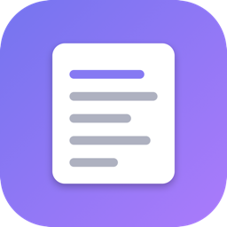

# PlainPaste

전역 단축키 하나로 **어디서든 서식 없는 Plain Text 붙여넣기**를 실행하는 macOS 메뉴바 앱.
클립보드가 **이미지면 자동으로 OCR**해서 인식된 텍스트를 대신 붙여넣습니다 — 단축키 하나로 글자/이미지 자동 분기.

<p align="center">
  
</p>

## 특징

- **서식 제거 붙여넣기** — 어떤 앱에서 복사했든 글꼴·색·링크 없이 순수 텍스트만
- **이미지 자동 OCR** — 스크린샷 등 이미지를 복사한 상태로 단축키를 누르면 온디바이스 Vision으로 글자를 인식해 붙여넣기 (한글·영문, 작은 글씨는 업스케일 보정)
- **창 항상 위 고정** — **⌃⌥⌘T**로 현재 창을 다른 앱 위로 고정 (다시 누르면 해제). PowerToys의 "Always On Top"에 대응
- **기본 단축키 ⌃⌥⌘V(붙여넣기)** — 메뉴바 아이콘 → "단축키 변경…"으로 자유롭게 재지정
- **가벼움** — 의존성 0, 맥 내장 프레임워크만, Dock 아이콘 없이 메뉴바에만 상주

## 설치

이 앱은 Apple 유료 개발자 서명이 없는 **ad-hoc 서명** 앱입니다. 아래 두 방법 모두 안전하게 설치되며, 상황에 맞게 고르세요.

### 방법 A — DMG (터미널 없이, 권장) 🖱️

> 남에게 공유하기 가장 쉬운 방법. 터미널이 필요 없습니다.

1. [Releases](../../releases/latest)에서 **`PlainPaste-1.1.dmg`** 를 받아 더블클릭해 엽니다.
2. 창 안의 **PlainPaste 아이콘을 Applications 폴더로 드래그**합니다. *(창에 화살표로 안내됩니다.)*
3. Launchpad나 응용 프로그램에서 **PlainPaste를 한 번 실행** → macOS Sequoia(15)에선 *"확인되지 않은 개발자"* 경고가 뜹니다.
4. **시스템 설정 → 개인정보 보호 및 보안**을 열고, 화면 맨 아래 *"'PlainPaste'을(를) 열 수 없습니다"* 옆의 **[그래도 열기]** 를 누른 뒤 다시 **[열기]** → 이걸로 끝. 이후로는 그냥 실행됩니다.

> DMG 창 자체에 이 순서가 그림으로 그려져 있어, 받는 분이 README 없이도 따라 할 수 있습니다.

### 방법 B — 터미널 한 줄 (경고 0회) ⌨️

터미널이 익숙하다면 이 한 줄이 가장 매끄럽습니다. 소스를 그 자리에서 컴파일해 설치하므로 **Gatekeeper 경고·"그래도 열기" 절차가 아예 없습니다** (내려받은 앱이 아니라 방금 만든 바이너리라 quarantine 딱지가 붙지 않기 때문):

```bash
curl -fsSL https://raw.githubusercontent.com/haseong23/plainpaste-macos/main/install.sh | bash
```

clone → 컴파일 → `/Applications` 설치 → 실행까지 자동입니다. Swift 컴파일러(Xcode Command Line Tools)가 없으면 설치 창을 한 번 띄우고 자동으로 이어받습니다. 레포를 이미 받아뒀다면 폴더 안에서 `./install.sh` 로 실행해도 동일합니다.

### 방법 C — 소스에서 직접 빌드

```bash
./build.sh                          # dist/PlainPaste.app 생성
cp -R dist/PlainPaste.app /Applications/
open /Applications/PlainPaste.app

./make_dmg.sh                       # (선택) 배포용 dist/PlainPaste-<버전>.dmg 생성
```

빌드는 맥 내장 `swiftc` / `hdiutil` 만 사용하며 외부 의존성이 없습니다.

## 최초 실행 시 권한 (손쉬운 사용)

붙여넣기 키 입력(⌘V)을 시스템에 전달해야 하므로 **손쉬운 사용** 권한이 필요합니다.
첫 실행 시 안내 창이 뜨면: **시스템 설정 → 개인정보 보호 및 보안 → 손쉬운 사용 → PlainPaste 켜기.**

> 재빌드하면 ad-hoc 서명이 바뀌어 권한이 풀릴 수 있습니다. 그 경우 목록에서 PlainPaste를 제거 후 다시 추가하세요.

## 사용법

### 서식 없는 붙여넣기 / OCR — ⌃⌥⌘V

1. 어디서든 텍스트나 이미지를 복사합니다.
2. **⌃⌥⌘V** 를 누릅니다.
   - 클립보드에 **글자가 있으면** → 서식 없는 순수 텍스트로 붙여넣기
   - **이미지면** → OCR로 인식한 텍스트를 붙여넣기 (인식된 글자가 없으면 경고음)

### 창 항상 위 고정 — ⌃⌥⌘T

1. 항상 위에 두고 싶은 창을 클릭해 최전면으로 만듭니다.
2. **⌃⌥⌘T** 를 누르면 그 창이 고정됩니다. 다시 누르면 해제 (메뉴바 아이콘에서도 토글·상태 확인 가능).

> **macOS 특성 안내.** Windows(`SetWindowPos(HWND_TOPMOST)`)와 달리 macOS엔 다른 앱 창을 진짜 '항상 위'로 만드는 공개 API가 없습니다. 그래서 손쉬운 사용 API로 고정한 창을 기억해 두고, **다른 앱이 앞으로 나올 때마다 그 창을 다시 최상단으로 끌어올리는** 방식(근사치)을 씁니다. 이 때문에 전환 시 **포커스가 고정 창으로 함께 이동**하고, 같은 앱의 다른 창 위로는 유지하지 않습니다. 고정한 창이 닫히거나 앱이 종료되면 자동 해제됩니다.

## 동작 방식

1. Carbon `RegisterEventHotKey`로 전역 단축키 수신 (이벤트 탭 없이 — 가장 가볍고 입력 지연 없음)
2. 클립보드에 **글자가 있으면** plain string만 추출; **이미지면** Vision으로 **OCR**해 텍스트로 변환(작은 글씨는 업스케일 후 인식). 이미 순수 텍스트면 클립보드를 건드리지 않고, 서식·이미지일 때만 순수 텍스트로 재기록
3. **물리 modifier 키가 모두 놓일 때까지 대기**(최대 1초) 후 활성 앱에 순수 ⌘V 전송
   — 단축키를 누른 손이 아직 ⌃⌥⌘를 누르고 있어도 엉뚱한 조합으로 전달되지 않음
   — modifier 대기·OCR 중 새로 복사(⌘C)한 게 감지되면 늦은 붙여넣기 자체를 취소해 새 복사를 덮어쓰지 않음

## 메뉴 (메뉴바 아이콘 클릭)

- **현재 단축키** 및 안내(이미지는 자동 OCR) 표시
- **직전 원본을 클립보드로 복원** — 서식·이미지를 벗겨 붙여넣은 뒤에도 원본이 다시 필요할 때.
  붙여넣기가 클립보드를 덮어쓴 직후에만 활성화되며, 복원하면 스크린샷/서식 원본이 그대로 돌아옵니다
- **단축키 변경…** — 창이 뜬 상태에서 새 조합을 누르면 즉시 저장 (⌘/⌥/⌃ 중 1개 이상 필수, ESC 취소)
- **창 항상 위 고정 / 고정 해제** — ⌃⌥⌘T와 동일. 고정 중이면 체크 표시와 함께 고정한 창 제목을 보여줍니다
- **로그인 시 자동 시작** 토글 (macOS 13+)
- **PlainPaste 종료**

## 요구 사항

- macOS 12 (Monterey) 이상 — 한글 OCR은 macOS 13 이상에서 지원
- 방법 B·C로 빌드하려면 Xcode Command Line Tools (`xcode-select --install`)

---

버전 **1.1** · 라이선스 자유 사용 · 맥 내장 프레임워크만 사용, 외부 의존성 0
